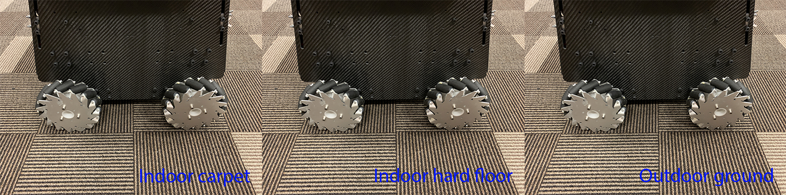

The repository contains the full autonomy stack for the Mecanum wheel platform. The platform is designed to support advanced AI in mind. Sensors installed on the platform include a [Livox Mid-360 lidar](https://www.livoxtech.com/mid-360). Additional sensors can be mounted to the top board with various mounting options available. The platform comes with an Intel NUC i7 computer for running the autonomy stack. Space is left for an additional Nvidia Jetson AGX Orin computer or a gaming laptop to run advanced AI models. The autonomy stack contains a SLAM module, a route planner, an exploration planner, and a based autonomy system, where the base autonomy system further includes fundamental navigation modules for terrain traversability analysts, collision avoidance, and waypoint following. The system overall is capable of taking a goal point and navigating the vehicle autonomously to the goal point as well as exploring an environment and building a map along the way. Alternatively, the system allows users to use a joystick controller to guide the navigation while the system itself is in charge of collision avoidance. We provide a simulation setup together with the real robot setup for users to take advantage of the system in various use cases. We open-source the full autonomy stack for users to reproduce the system.

<p align="center">
  
</p>

## Simulation Setup

### Base Autonomy

The system is integrated with [Unity](https://unity.com) environment models for simulation. The repository has been tested in Ubuntu 24.04 with [ROS2 Jazzy](https://docs.ros.org/en/jazzy/Installation.html). After installing ROS2 Jazzy, add 'source /opt/ros/jazzy/setup.bash' to the '~/.bashrc' file and `source ~/.bashrc` in the terminal to engage the installation.
```
echo "source /opt/ros/jazzy/setup.bash" >> ~/.bashrc
source ~/.bashrc
```
Install dependencies with the command lines below.
```
sudo apt update
sudo apt install ros-jazzy-desktop-full ros-jazzy-pcl-ros libpcl-dev git
```
Clone the open-source repository.
```
git clone https://github.com/jizhang-cmu/autonomy_stack_mecanum_wheel_platform.git

```
In a terminal, go to the folder, checkout the 'jazzy' branch, and compile. Note that this skips the SLAM module and Mid-360 lidar driver. The two packages are not needed for simulation.
```
cd autonomy_stack_mecanum_wheel_platform
git checkout jazzy
colcon build --symlink-install --cmake-args -DCMAKE_BUILD_TYPE=Release --packages-skip arise_slam_mid360 arise_slam_mid360_msgs livox_ros_driver2
```
Download a [Unity environment model for the Mecanum wheel platform](https://drive.google.com/drive/folders/1G1JYkccvoSlxyySuTlPfvmrWoJUO8oSs?usp=sharing) and unzip the files to the 'src/base_autonomy/vehicle_simulator/mesh/unity' folder. The environment model files should look like below. For computers without a powerful GPU, please try the 'without_360_camera' version for a higher rendering rate.

mesh/<br>
&nbsp;&nbsp;&nbsp;&nbsp;unity/<br>
&nbsp;&nbsp;&nbsp;&nbsp;&nbsp;&nbsp;&nbsp;&nbsp;environment/<br>
&nbsp;&nbsp;&nbsp;&nbsp;&nbsp;&nbsp;&nbsp;&nbsp;&nbsp;&nbsp;&nbsp;&nbsp;Model_Data/ (multiple files in the folder)<br>
&nbsp;&nbsp;&nbsp;&nbsp;&nbsp;&nbsp;&nbsp;&nbsp;&nbsp;&nbsp;&nbsp;&nbsp;Model.x86_64<br>
&nbsp;&nbsp;&nbsp;&nbsp;&nbsp;&nbsp;&nbsp;&nbsp;&nbsp;&nbsp;&nbsp;&nbsp;UnityPlayer.so<br>
&nbsp;&nbsp;&nbsp;&nbsp;&nbsp;&nbsp;&nbsp;&nbsp;&nbsp;&nbsp;&nbsp;&nbsp;AssetList.csv (generated at runtime)<br>
&nbsp;&nbsp;&nbsp;&nbsp;&nbsp;&nbsp;&nbsp;&nbsp;&nbsp;&nbsp;&nbsp;&nbsp;Dimensions.csv<br>
&nbsp;&nbsp;&nbsp;&nbsp;&nbsp;&nbsp;&nbsp;&nbsp;&nbsp;&nbsp;&nbsp;&nbsp;Categories.csv<br>
&nbsp;&nbsp;&nbsp;&nbsp;&nbsp;&nbsp;&nbsp;&nbsp;map.ply<br>
&nbsp;&nbsp;&nbsp;&nbsp;&nbsp;&nbsp;&nbsp;&nbsp;object_list.txt<br>
&nbsp;&nbsp;&nbsp;&nbsp;&nbsp;&nbsp;&nbsp;&nbsp;traversable_area.ply<br>
&nbsp;&nbsp;&nbsp;&nbsp;&nbsp;&nbsp;&nbsp;&nbsp;map.jpg<br>
&nbsp;&nbsp;&nbsp;&nbsp;&nbsp;&nbsp;&nbsp;&nbsp;render.jpg<br>

In a terminal, go to the repository folder and launch the system.
```
./system_simulation.sh
```
After seeing data showing up in RVIZ, users can use the 'Waypoint' button to set waypoints and navigate the vehicle around. Note that the waypoints are meant to be relatively close to the vehicle. Setting the waypoint too far can cause the vehicle to get stuck at a dead end. Users can also operate in *smart joystick mode* where the vehicle tries to follow joystick commands and also avoid collisions. To do this, users can use the control panel in RVIZ or a PS3/4 or Xbox controller with a USB or Bluetooth interface. When using the controller, users can also operate in *manual mode* without any collision avoidance. Detailed information about the operations in the three modes is below.

<p align="center">
  <br>
  <em>Base autonomy (smart joystick, waypoint, and manual modes)</em>
</p>

- *Smart joystick mode (default)*: The vehicle tries to follow joystick commands and also avoid collisions. Use the control panel in RVIZ or the right joystick on the controller to set the speed and yaw rate. If the system is in another mode, doing so will switch the system to *smart joystick mode*.

- *Waypoint mode*: The vehicle tries to follow waypoints and also avoid collisions. Use the 'Waypoint' button in RVIZ to set a waypoint by first clicking the button and then clicking where the waypoint is to be set around the vehicle. If the system is in another mode, clicking the 'Resume Navigation to Goal' button in RVIZ switches the system to *waypoint mode*. Or, users can hold the 'waypoint-mode' button on the controller and use the right joystick to set the speed. If only holding the 'waypoint-mode' button, the system will use the speed sent in ROS messages.

- *Manual mode*: The vehicle tries to follow joystick commands without any collision avoidance. Pressing the 'manual-mode' button on the controller switches the system to *manual mode*. Then, use the right joystick to set the forward and lateral speed and the left joystick to set the yaw rate, in the Mode 2 convention.

<p align="center">
  
  &nbsp;&nbsp;&nbsp;&nbsp;
  
</p>

Alternatively, users can run a ROS node to send a series of waypoints. In another terminal, go to the folder and source the ROS workspace, then run the ROS node with the command lines below. The ROS node sends navigation boundary and speed as well. Click the 'Resume Navigation to Goal' button in RVIZ, and the vehicle will navigate inside the boundary following the waypoints. More information about the base autonomy system is available on the [Autonomous Exploration Development Environment](https://www.cmu-exploration.com) website.
```
source install/setup.sh
ros2 launch waypoint_example waypoint_example.launch
```

### Route Planner

The route planner conducts planning in the global environment and guides the vehicle to navigate to a goal point. To launch the system with route planner, use the command line below.
```
./system_simulation_with_route_planner.sh
```
Users can send a goal point with the 'Goalpoint' button in RVIZ. The vehicle will navigate to the goal and build a visibility graph (in cyan) along the way. Areas covered by the visibility graph become free space. When navigating in free space, the planner uses the built visibility graph, and when navigating in unknown space, the planner attempts to discover a way to the goal. By pressing the 'Reset Visibility Graph' button, the planner will reinitialize the visibility graph. By unchecking the 'Planning Attemptable' checkbox, the planner will first try to find a path through the free space. The path will show in green. If such a path does not exist, the planner will consider unknown space together. The path will show in blue. By unchecking the 'Update Visibility Graph' checkbox, the planner will stop updating the visibility graph. When navigating with the route planner, the base system operates in *waypoint mode*. Users can click in the black box on the control panel to switch to *smart joystick mode*, or press the buttons on a joystick controller to switch to *smart joystick mode* or *manual mode*. To resume route planner navigation, click the 'Resume Navigation to Goal' button in RVIZ or use the 'Goalpoint' button to set a new goalpoint. More information about the route planner is available on the [FAR Planner website](https://github.com/MichaelFYang/far_planner).

<p align="center">
  <br>
  <em>Base autonomy with route planner</em>
</p>

### Exploration Planner

The exploration planner conducts planning in the global environment and guides the vehicle to cover the environment. To launch the system with exploration planner, use the command line below.
```
./system_simulation_with_exploration_planner.sh
```
Click the 'Resume Navigation to Goal' button in RVIZ to start the exploration. Users can adjust the navigation boundary to constrain the areas to explore by updating the boundary polygon in the 'src/exploration_planner/tare_planner/data/boundary.ply' file. When navigating with the exploration planner, the base system operates in *waypoint mode*. Users can click in the black box on the control panel to switch to *smart joystick mode*, or press the buttons on a joystick controller to switch to *smart joystick mode* or *manual mode*. To resume exploration, click the 'Resume Navigation to Goal' button in RVIZ. Note that previously, due to usage of [OR-Tools](https://developers.google.com/optimization) library, the exploration_planner only supports AMD64 architecture. A recent upgrade to the library made it compatible with both AMD64 and ARM computers. On ARM computers, please download the corresponding [binary release](https://github.com/google/or-tools/releases) for the target platform, for example, [or-tools_arm64_debian-11_cpp_v9.8.3296.tar.gz](https://github.com/google/or-tools/releases/download/v9.8/or-tools_arm64_debian-11_cpp_v9.8.3296.tar.gz), extract it, and replace the 'include' and 'lib' folders under 'src/exploration_planner/tare_planner/or-tools'. More information about the exploration planner is available on the [TARE Planner website](https://github.com/caochao39/tare_planner).

<p align="center">
  <br>
  <em>Base autonomy with exploration planner</em>
</p>

## Real-robot Setup

### Hardware

The vehicle hardware is designed to support advanced AI in mind. Space is left for users to install a Jetson AGX Orin computer or a gaming laptop. Mounting slots and holes are available on the top board for users to install additional sensors. The vehicle is equipped with a 19v inverter and a 110v inverter, both at 400W rating to power the sensors and computers. A wireless HDMI module transmits HDMI signals to a control station, allowing users to work with the vehicle as a desktop computer - the computer moves around in the environment and communicates with the control station wirelessly.

We supply two types of wheels to use with the vehicle. On indoor carpet, please use the Mecanum wheels. On indoor hard floor and outdoors, we recommend switching to the standard wheels.

<p align="center">
  
  &nbsp;&nbsp;&nbsp;&nbsp;
  
</p>

<p align="center">
  
</p>

<p align="center">
  
</p>

### System Setup

On the processing computer, install [Ubuntu 24.04](https://releases.ubuntu.com/noble), connect the computer to Internet, and install [ROS2 Jazzy](https://docs.ros.org/en/jazzy/Installation.html). After installation of ROS2 Jazzy, add 'source /opt/ros/jazzy/setup.bash' to the '~/.bashrc' file and `source ~/.bashrc` in the terminal to engage the installation, or use the command lines below. Add user to the dialout group by `sudo adduser 'username' dialout`. Then, reboot the computer. Optionally, configure BIOS and set the computer to automatically boot when power is supplied

```
echo "source /opt/ros/jazzy/setup.bash" >> ~/.bashrc
source ~/.bashrc
sudo adduser 'username' dialout
sudo reboot now
```

#### 1) All Dependencies

Please install dependencies with the command lines below before proceeding to the next setup steps.

```
sudo apt update
sudo apt install ros-jazzy-desktop-full ros-jazzy-pcl-ros libpcl-dev git cmake libgoogle-glog-dev libgflags-dev libatlas-base-dev libeigen3-dev libsuitesparse-dev
```

#### 2) Mid-360 Lidar

First, clone the open-source repository and checkout the 'jazzy' branch.

```
git clone https://github.com/jizhang-cmu/autonomy_stack_mecanum_wheel_platform.git
cd autonomy_stack_mecanum_wheel_platform
git checkout jazzy
```

Next, install ‘Livox-SDK2’. In a terminal, go to the 'src/utilities/livox_ros_driver2/Livox-SDK2' folder in the repository and use the command lines below. More information about [‘Livox-SDK2’ can be found here](https://github.com/Livox-SDK/Livox-SDK2).

```
mkdir build && cd build
cmake ..
make && sudo make install
```

Now, compile the Mid-360 lidar driver. Note that the driver needs to be configured specifically to the lidar. In the 'src/utilities/livox_ros_driver2/config/MID360_config.json' file, under the 'lidar_configs' settings, set the IP to 192.168.1.1xx, where xx are the last two digits of the lidar serial number (you can find it on a sticker under a QR code on the lidar).

```
cd autonomy_stack_mecanum_wheel_platform
colcon build --symlink-install --cmake-args -DCMAKE_BUILD_TYPE=Release --packages-select livox_ros_driver2
```

Connect the lidar to the Ethernet port on the processing computer and power it on. Set the processing computer IP to 192.168.1.5, with netmask 255.255.255.0 and gateway 192.168.1.1. The IP is specified in the same json file. At this point, you should be able to pin the lidar by `ping 192.168.1.1xx`. Then, launch the driver with RVIZ to view the scan data. More information about [the Mid-360 lidar driver is available here](https://github.com/Livox-SDK/livox_ros_driver2).

```
source install/setup.sh
ros2 launch livox_ros_driver2 rviz_MID360_launch.py
```

#### 3) SLAM Module

In a terminal, go to the 'src/slam/dependency/Sophus' folder and install 'Sophus'.

```
mkdir build && cd build
cmake .. -DBUILD_TESTS=OFF
make && sudo make install
```

Then, go to the 'src/slam/dependency/ceres-solver' folder and install 'Ceres Solver'. More information about [Ceres Solver is available here](http://ceres-solver.org).

```
mkdir build && cd build
cmake ..
make -j6 && sudo make install
```

Next, go to the 'src/slam/dependency/gtsam' folder and install 'gtsam'. More information about [GTSAM is available here](https://gtsam.org).

```
mkdir build && cd build
cmake .. -DGTSAM_USE_SYSTEM_EIGEN=ON -DGTSAM_BUILD_WITH_MARCH_NATIVE=OFF
make -j6 && sudo make install
sudo /sbin/ldconfig -v
```

Now, compile the SLAM module. Note that the Mid-360 lidar driver is a dependency of the SLAM module. Please make sure it is already compiled.

```
cd autonomy_stack_mecanum_wheel_platform
colcon build --symlink-install --cmake-args -DCMAKE_BUILD_TYPE=Release --packages-select arise_slam_mid360 arise_slam_mid360_msgs
```

#### 4) Motor Controller

Connect the motor controller to the processing computer via a USB cable. Determine the serial device on the processing computer. You may list all the entries by `ls /dev`. The device is likely registered as '/dev/ttyACM0' or '/dev/ttyACM1'... In the 'src/base_autonomy/local_planner/launch/local_planner.launch' and 'src/utilities/teleop_joy_controller/launch/teleop_joy_controller.launch' files, update the '/dev/ttyACM0' entry and compile the serial driver.

```
cd autonomy_stack_mecanum_wheel_platform
colcon build --symlink-install --cmake-args -DCMAKE_BUILD_TYPE=Release --packages-select serial teleop_joy_controller

```

Take the PS3 controller and plug the USB dongle into the processing computer. Some controllers have different modes. Make sure the controller is in the right mode (usually the factory default mode) and is powered on. For this particular controller, the two LEDs on top of the center button should be lit to indicate the right mode. Holding the center button for a few seconds changes the mode. Now, power on the vehicle. Use the command lines below to launch the teleoperation test. Users can use the right joystick to set the forward and lateral speed and the left joystick to set the yaw rate. Be cautious and drive slowly at the beginning.

```
source install/setup.sh
ros2 launch teleop_joy_controller teleop_joy_controller.launch
```

#### 5) Full Repository

After completion of the above setup steps, you can compile the full repository.

```
cd autonomy_stack_mecanum_wheel_platform
colcon build --symlink-install --cmake-args -DCMAKE_BUILD_TYPE=Release
```

### System Usage

Power on the vehicle. In a terminal, go to the repository folder and use the command line below to launch the system. This launches the SLAM module and the base autonomy system together with the vehicle motor controller drivers.

```
./system_real_robot.sh
```

Now, users can follow the same operations as in the simulation setup to navigate the vehicle in the environment. Please refer to the Simulation Setup section for operating the system in the *smart joystick mode*, *waypoint mode*, and *manual mode* using a combination of the 'Waypoint' button and control panel in RVIZ and the PS3 controller.

<p align="center">
  <br>
  <em>Collision avoidance</em>
</p>

To launch the system with route planner or exploration planner, use the command lines below. Follow the same procedures as in the Simulation Setup section to operate the system.

For route planner:
```
./system_real_robot_with_route_planner.sh
```
For exploration planner:
```
./system_real_robot_with_exploration_planner.sh
```

<p align="center">
  <br>
  <em>Route planning</em>
</p>

<p align="center">
  <br>
  <em>Exploration</em>
</p>

To record the sensor data to a bagfile, source the ROS workspace (due to custom format for the scan messages) and use the command lines below in another terminal while the system is running.

```
source install/setup.bash
ros2 bag record /imu/data /lidar/scan -o 'bagfolder_path'
```

To launch the system for bagfile processing, use of the command lines below.

For base system:
```
./system_bagfile.sh
```
For route planner:
```
./system_bagfile_with_route_planner.sh
```
For exploration planner:
```
./system_bagfile_with_exploration_planner.sh
```

In another terminal, source the ROS workspace (required for .db3 bagfiles) and play the bagfile.

```
source install/setup.bash
ros2 bag play 'bagfolder_path/bagfile_name.mcap (or bagfile_name.db3)'
```

[A few example bagfiles are provided here](https://drive.google.com/drive/folders/1G1JYkccvoSlxyySuTlPfvmrWoJUO8oSs?usp=sharing). Users can use the bagfiles to test the system offline without accessing the real-robot setup. Note that for bagfile processing, please follow the System Setup section above to compile the repository fully.

## AI Extensions

### Installing Add-on Computer

Multiple options are available for advanced AI support. Users can mount an Jetson AGX Orin computer or a gaming laptop in the reserved spaces. For either option, use the 19v or 110v output to power on the computer. The add-on computer should have Ubuntu 24.04 and [ROS2 Jazzy](https://docs.ros.org/en/jazzy/Installation.html) installed. Connect the add-on computer to the NUC i7 computer via an ethernet cable (optionally with USB-Ethernet adapters on one or both sides). We recommend using manual IP and setting the subnet address to 10.1.1.x (e.g. NUC i7 computer at 10.1.1.100 and add-on computer at 10.1.1.101). With the vehicle system running on the NUC i7 computer, users should be able to list all the topics on the add-on computer using `ros2 topic list`. If also connecting the add-on computer to the internet, configure it to 'Use this connection only for resources on its network' for the Ethernet connection to the NUC i7 computer.

To synchronize the system time between the NUC i7 computer and the add-on computer, install chrony.
```
sudo apt install chrony
```
Use the provided chrony configuration file to overwrite the original 'chrony.conf' file in the '/etc/chrony' folder. Then, restart chrony. Execute these steps on both computers.
```
sudo cp ./chrony_conf/chrony.conf /etc/chrony
sudo systemctl restart chrony.service
```
The provided configuration sets the computer at 10.1.1.100 as the server. We recommend setting the NUC i7 computer to 10.1.1.100 as the server and the add-on computer on the 10.1.1.x subnet, e.g. 10.1.1.101, as the client. If connecting the client computer to the internet, make sure to use `timedatectl set-ntp false` to stop synchronizing to the servers on the internet. On the client computer, users can check the synchronization status.
```
chronyc sources
```

### Transmitting Data over WiFi

Another option is wirelessly transmitting data to a base station computer installed with Ubuntu 24.04 and [ROS2 Jazzy](https://docs.ros.org/en/jazzy/Installation.html), allowing users to run AI models on the base station computer with powerful GPUs. The setup involves a high-speed WiFi router. The model tested is an [ASUS RT-AX55 WiFi router](https://www.amazon.com/ASUS-AX1800-WiFi-Router-RT-AX55/dp/B08J6CFM39). Configure the router and set up the subnet. We recommend using automatic IP and setting the subnet address to 10.1.1.x (please avoid the 192.168.1.x subnet as being used by the Mid-360 lidar, and do not connect the router to the internet). Connect the base station computer to the router with an Ethernet cable and the onboard NUC i7 computer to the router over WiFi, both using 'Automatic (DHCP)'. Make sure both computers are on the same subnet and can ping each other. On the NUC i7 computer computer, use the command lines below to increase the message buffer size. Then, you can use `sysctl net.core.rmem_max` and `sysctl net.core.wmem_max` to check the buffer size.
```
sudo sysctl -w net.core.rmem_max=67108864 net.core.rmem_default=67108864
sudo sysctl -w net.core.wmem_max=67108864 net.core.wmem_default=67108864
```
Start the vehicle system. On the base station computer, users should be able to list all the topics using `ros2 topic list`. In a terminal on the NUC i7 computer, go to the repository folder, source the ROS workspace, and launch the domain bridge. This shares a few topics to the base station computer domain (ROS_DOMAIN_ID=1).
```
source install/setup.bash
ros2 launch domain_bridge domain_bridge.launch
```
In a terminal on the base station computer, use `export ROS_DOMAIN_ID=1` followed by `ros2 topic list` to list the topics shared to the base station computer domain. Now, copy the 'base_station' folder in the repository to the base station computer. In a terminal, go to the folder and use the command line below to launch RVIZ and view data transmitted over the network.
```
./base_station.sh
```
Users can set up AI models on the base station computer to process the transmitted data and send waypoints back to guide the navigation. When launching the AI model, please set `export ROS_DOMAIN_ID=1` in the terminal. Note that if a camera is added, the data transmission expects compressed images to be sent to the base station computer. Please prepare compressed images on the '/camera/image/compressed' topic on the NUC i7 computer. The images are then uncompressed in the 'base_station.sh' script after transmission. On the base station computer, please make sure to subscribe to the uncompressed images on the '/camera/image/transmitted' topic. If accessing internet on the base station computer at the same time, users can connect the base station computer to internet over WiFi and then in the wired network settings, under IPv4 tab, check "use this connection only for resources on its network".

<p align="center">
  <br>
  <em>Wirelessly transmitting data to base station computer</em>
</p>

## Notes

- In ROS2 Jazzy, RVIZ is known to have issues with wayland. Use `echo $XDG_SESSION_TYPE` to check if wayland is being used. If yes, install X11 using `sudo apt-get install xorg openbox`. Then, in the '/etc/gdm3/custom.conf' file, uncomment 'WaylandEnable=false' and reboot.

- In simulation, the bridge between Unity and the system is not completely stable. At the system launch, if you see an error regarding 'ros_tcp_endpoint', simply try for a second time.

- If the PS3 controller is not recognized correctly at the power on of the processing computer, unplug and re-plug in the USB dongle.

- The sensor configuration leaves 1.2m of blind area in front of the vehicle at ground level. If something low jumps into the area, the system would not know.

- Occasionally, we observe SLAM drift which can cause issues with the terrain map and collision avoidance. Symptoms are vehicle getting stuck or moving in strange directions and not following waypoints. Users can press the 'clear-terrain-map button' on the joystick controller to reset the terrain map. At the system start up, if the SLAM module gives a warning saying the lidar and IMU data are out of synchronization, please restart the system.

- If changing between Mecanum wheels and standard wheels, go to the 'src/base_autonomy/local_planner/launch/local_planner.launch' file and change 'config' between 'omniDir' and 'standard' accordingly. When installing the Mecanum wheels, please make sure to install them in the same configuration as in the pictures.

- The route planner and exploration planner are provided with indoor and outdoor configurations. To change the configuration, go to the 'src/base_autonomy/vehicle_simulator/launch' folder and find 'route_planner_config' in the 'system_unity_with_route_planner.launch', 'system_real_robot_with_route_planner.launch', and 'system_bagfile_with_route_planner.launch' files, and 'exploration_planner_config' in the 'system_unity_with_exploration_planner.launch', 'system_real_robot_with_exploration_planner.launch', and 'system_bagfile_with_exploration_planner.launch' files. Users can configure the settings for Unity simulation, real-robot deployment, and bagfile processing differently in the launch files. The default is set to indoor for both planners.

- The speed is set in the 'src/base_autonomy/local_planner/launch/local_planner.launch' file. The 'maxSpeed' defines the maximum speed in all modes and 'autonomySpeed' defines the speed in *waypoint mode*. When navigating in tight areas, please reduce both speeds to 0.75 or 0.5 (m/s).

- In indoor environments, to avoid low obstacles, users can reduce 'obstacleHeightThre' in the 'src/base_autonomy/local_planner/launch/local_planner.launch' file from 0.15 to as small as 0.015 or 0.02. The vehicle will avoid obstacles at 2-2.5cm above ground. Please set the threshold higher (0.1-0.15) in outdoor environments.

- To save a point cloud file during a run, users can set 'savePcd = true' in the 'src/base_autonomy/visualization_tools/launch/visualization_tools.launch' file. A 'pointcloud_xxx.txt' file is saved in the 'src/base_autonomy/vehicle_simulator/log' folder together with a trajectory file, where 'xxx' is the timestamp. The format is described in the 'readme.txt' file in the same folder. Once a point cloud file is saved, users can start the SLAM module in localization mode. Copy the point cloud file to the desktop and rename it 'pointcloud_local.txt'. Then, in the 'src/slam/arise_slam_mid360/config/livox_mid360.yaml' file, set 'local_mode = true' and adjust 'init_x', 'init_y', 'init_z', 'init_yaw' for the start pose.

## Credits

The project collaborates between [Ting Cao's](https://www.microsoft.com/en-us/research/people/ticao) group at Microsoft Research and [Ji Zhang's](https://frc.ri.cmu.edu/~zhangji) group at Carnegie Mellon University.

[gtsam](https://gtsam.org) [Ceres Solver](http://ceres-solver.org), [Sophus](http://github.com/strasdat/Sophus.git), [domain_bridge](https://github.com/ros2/domain_bridge), [livox_ros_driver2](https://github.com/Livox-SDK/livox_ros_driver2), [Livox-SDK2](https://github.com/Livox-SDK/Livox-SDK2), [ROS-TCP-Endpoint](https://github.com/Unity-Technologies/ROS-TCP-Endpoint), and [serial](https://github.com/wjwwood/serial) packages are from open-source releases.

## Relevant Links

The SLAM module is an upgraded implementation of [LOAM](https://github.com/cuitaixiang/LOAM_NOTED).

The base autonomy system is based on [Autonomous Exploration Development Environment](https://www.cmu-exploration.com).

The route planner is based on [FAR Planner](https://github.com/MichaelFYang/far_planner).

The exploration planner is based on [TARE Planner](https://github.com/caochao39/tare_planner).
